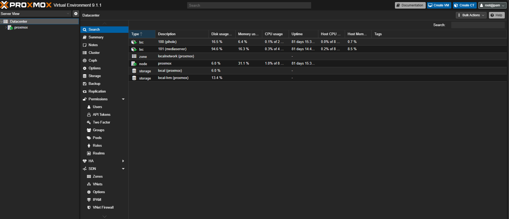
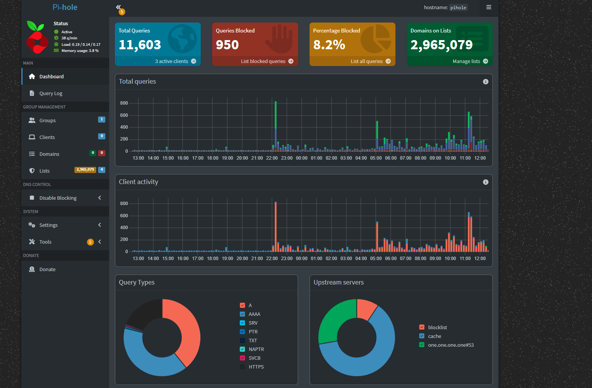
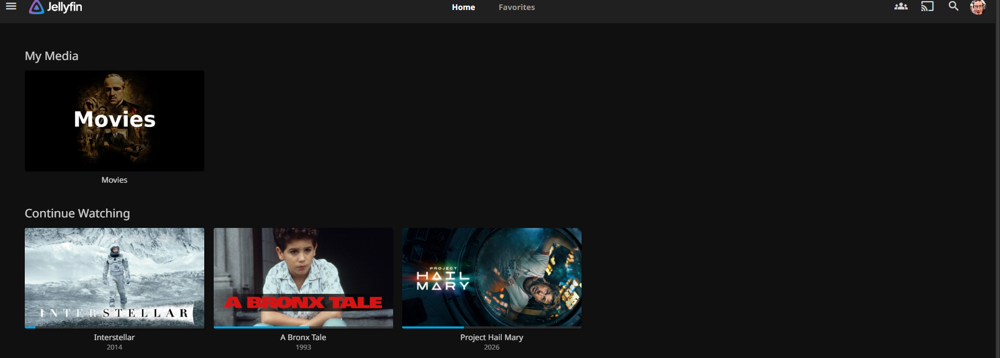

# Home Lab Infrastructure

I built a personal media server that runs 24/7 on a Lenovo M630e mini PC. 
Friends can request and stream movies from anywhere in the world, 
all downloads are encrypted and anonymous, and nothing is exposed to the internet.

## Hardware

- **Device:** Lenovo ThinkCentre M630e
- **RAM:** 8GB
- **Storage:** 500GB SSD + external drive for media

## What it does

- Friends open a link, request any movie, and it automatically downloads and appears in their library
- All torrent traffic is routed through a VPN — fully encrypted and anonymous
- Accessible from anywhere in the world with no open ports on the router
- Blocks ads network-wide for every device on the network
- Runs completely automatically — no manual intervention needed

## Stack

| Service | Purpose |
|---|---|
| **Proxmox VE** | Runs multiple isolated virtual servers on one machine |
| **Pi-hole** | Blocks ads for every device on the network at the DNS level |
| **Prowlarr** | Searches torrent sites for requested content |
| **Radarr** | Automates the entire movie download process |
| **qBittorrent** | Downloads torrents through an encrypted VPN tunnel |
| **PIA VPN** | Encrypts all download traffic using WireGuard protocol |
| **Jellyfin** | Streams media to any device anywhere |
| **Jellyseerr** | Lets friends request movies through a clean interface |
| **nginx** | Directs incoming traffic to the right service internally |
| **Tailscale Funnel** | Exposes services securely without opening any router ports |

## Challenges I solved

**Running a VPN inside a virtual container**
VPN software needs kernel access that virtual containers 
normally block. Solved by configuring the host system to grant the 
required permissions and adjusting the container's privilege settings.

**Secure remote access without exposing the server**
Opening router ports would expose the home IP address and create 
security risks. Used Tailscale Funnel to create a secure public URL 
backed by Tailscale's infrastructuren No ports opened and also no IP exposed.

**Routing traffic between services**
Tailscale only talks to localhost internally, but the media services 
run on a different internal IP. Added nginx as a middleman to bridge 
the gap and route traffic to the correct destination.

## Screenshots
## Screenshots

